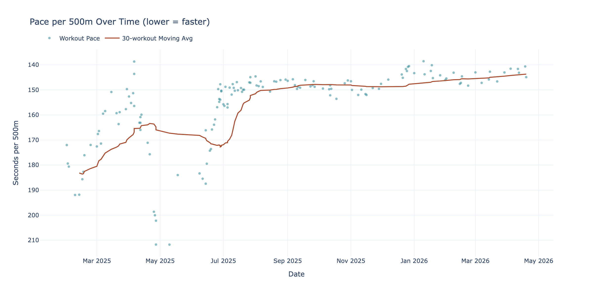

# Concept2 Logbook Pipeline

A production-grade ELT pipeline that ingests Concept2 Logbook rowing workout data into Postgres through three medallion layers, orchestrated by **Dagster** and loaded by **dlt**.





```
Concept2 API ──dlt──► concept2_bronze.results   (raw)
                           │
                     SQL transform
                           │
                           ▼
                   concept2_silver.workouts  (cleaned)
                           │
                     Plotly charts
                           │
                           ▼
                     charts_output/*.png / *.html
```

---

## Architecture

| Layer  | Tool        | Postgres schema      | Description |
|--------|-------------|----------------------|-------------|
| Bronze | dlt         | `concept2_bronze`    | Raw API rows, incremental merge on `id` |
| Silver | SQLAlchemy  | `concept2_silver`    | Typed, cleaned, pace derived |
| Gold   | Plotly      | *(files on disk)*    | 7 interactive charts + PNGs |

---

## Incremental Loading

dlt tracks the highest `date` value seen across runs in its internal state
table (`concept2_bronze._dlt_pipeline_state`).  On every subsequent run only
workouts newer than that cursor are requested from the API:

```
GET /api/users/me/results?updated_after=<last_seen_date>&per_page=250
```

This means an account with years of history does a **full load only once**;
every subsequent daily run fetches only the new rows from the past 24 hours.

To force a full reload:
```bash
# Delete the dlt state for this pipeline then re-run
python -c "
import dlt
p = dlt.pipeline('concept2_bronze', destination='postgres', dataset_name='concept2_bronze')
p.drop()
"
```

---

## Quick Start (local, no Docker)

### 1. Prerequisites

- Python 3.11+
- Postgres running locally (or update `PG_CONN`)

### 2. Install

```bash
cd concept2_pipeline
pip install -e .
```

### 3. Configure environment

```bash
cp .env.example .env
# Edit .env — fill in C2_CLIENT_ID and C2_CLIENT_SECRET
```

### 4. Obtain OAuth token (one-time)

```bash
python -m concept2_pipeline.auth
# Browser opens, approve access, token is written to .env
```

### 5. Export env vars

```bash
export $(grep -v '^#' .env | xargs)
```

### 6. Configure dlt Postgres credentials

Edit `.dlt/secrets.toml`:
```toml
[destination.postgres.credentials]
database = "concept2"
username = "concept2"
password = "concept2pass"
host     = "localhost"
port     = 5432
```

### 7. Start Dagster

```bash
dagster dev -m concept2_pipeline.definitions
```

Open [http://localhost:3000](http://localhost:3000), go to **Assets**, and
click **Materialize All**.

---

## Docker Compose

```bash
cp .env.example .env
# Fill in C2_CLIENT_ID, C2_CLIENT_SECRET, C2_ACCESS_TOKEN

docker compose up --build
```

Dagster UI at [http://localhost:3000](http://localhost:3000).

Note: obtain `C2_ACCESS_TOKEN` on your host first:
```bash
pip install requests requests-oauthlib
python -m concept2_pipeline.auth
# Copy token into .env as C2_ACCESS_TOKEN
```

---

## Daily Schedule

The pipeline is scheduled to run every day at **06:00 UTC** via the
`concept2_daily_refresh` schedule (enabled by default).  You can also trigger
it manually from the Dagster UI or CLI:

```bash
dagster job execute -m concept2_pipeline.definitions -j concept2_full_pipeline
```

---

## Charts generated

| File | Description |
|------|-------------|
| `monthly_distance_bar.png` | Total metres per calendar month |
| `cumulative_distance_line.png` | Running total distance over time |
| `pace_trend_scatter.png` | Pace per 500m + 30-workout moving average |
| `heart_rate_trend.png` | Avg + max HR per workout |
| `workout_type_breakdown.png` | Donut chart by activity type |
| `distance_histogram.png` | Distribution of individual workout distances |
| `weekly_volume_stacked.png` | Weekly volume stacked by activity type |

Each chart is also saved as an interactive `.html` file in `charts_output/`.

---

## Project Layout

```
concept2_pipeline/
├── concept2_pipeline/
│   ├── auth.py                  # OAuth2 token helper (run once)
│   ├── definitions.py           # Dagster Definitions entry point
│   ├── assets/
│   │   ├── bronze.py            # dlt_assets → concept2_bronze schema
│   │   ├── silver.py            # SQL transform → concept2_silver schema
│   │   └── gold.py              # Plotly charts → charts_output/
│   ├── resources/
│   │   └── postgres_resource.py # Configurable SQLAlchemy resource
│   └── sources/
│       └── concept2_source.py   # dlt @source + @resource (incremental)
├── charts_output/               # Generated charts (git-ignored)
├── .dlt/
│   └── secrets.toml             # dlt Postgres credentials (git-ignored)
├── .env.example                 # Environment variable template
├── docker-compose.yml
├── Dockerfile
├── workspace.yaml
└── pyproject.toml
```

---

## Environment Variables

| Variable | Description |
|----------|-------------|
| `C2_CLIENT_ID` | Concept2 OAuth app client ID |
| `C2_CLIENT_SECRET` | Concept2 OAuth app client secret |
| `C2_ACCESS_TOKEN` | Bearer token from `python -m concept2_pipeline.auth` |
| `PG_CONN` | SQLAlchemy Postgres URL (used by silver + gold layers) |
| `CHARTS_OUTPUT_DIR` | Override chart output directory (default: `charts_output`) |
| `DAGSTER_POSTGRES_*` | Dagster run-history DB (see docker-compose.yml) |
