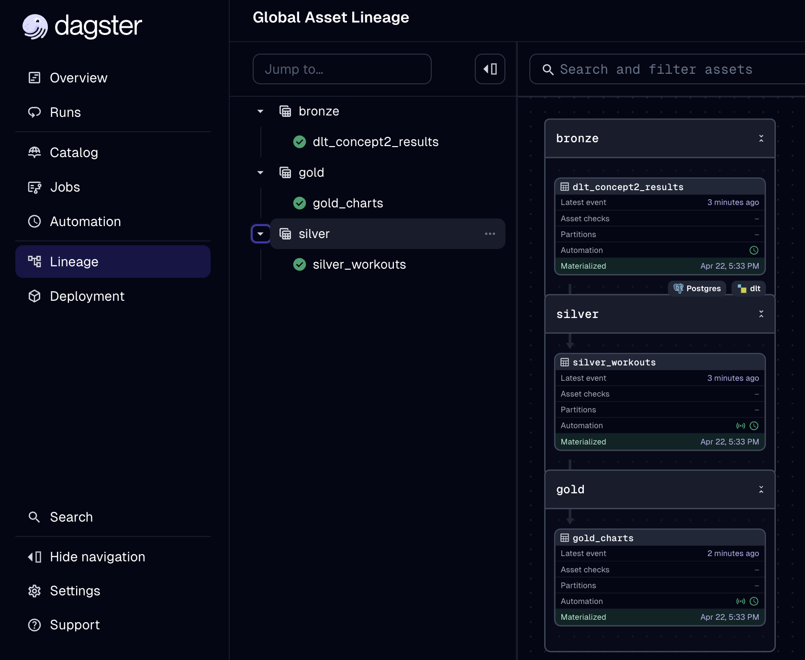
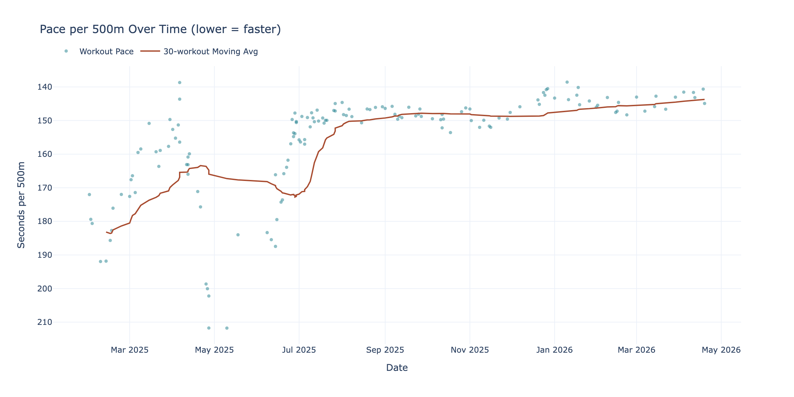
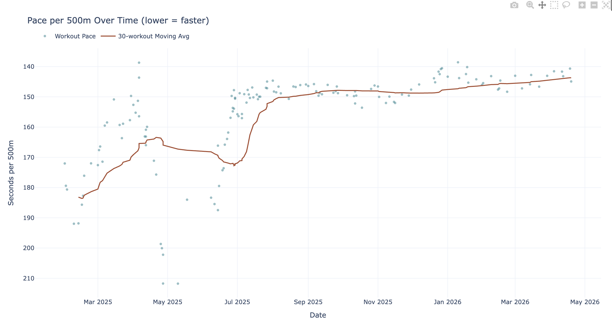
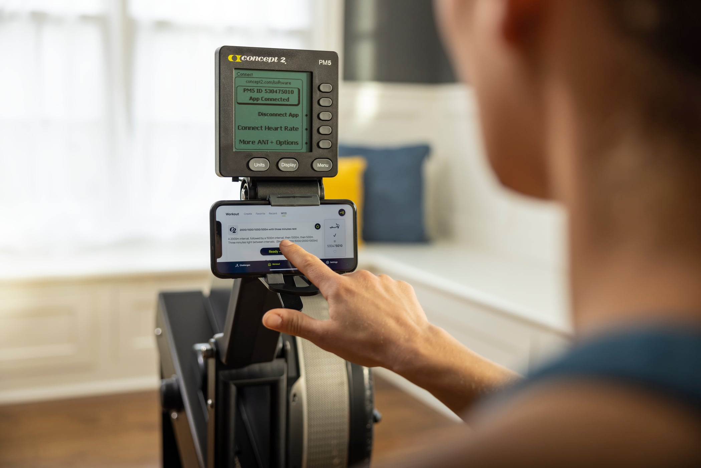
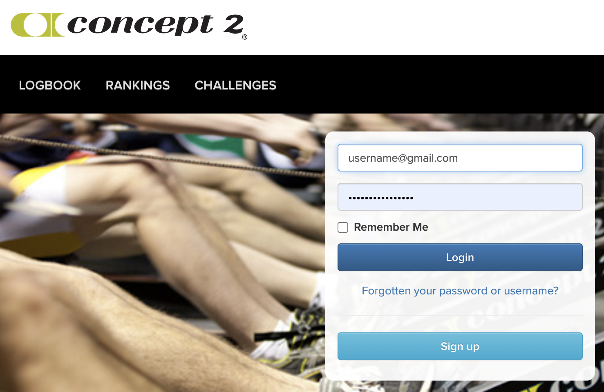
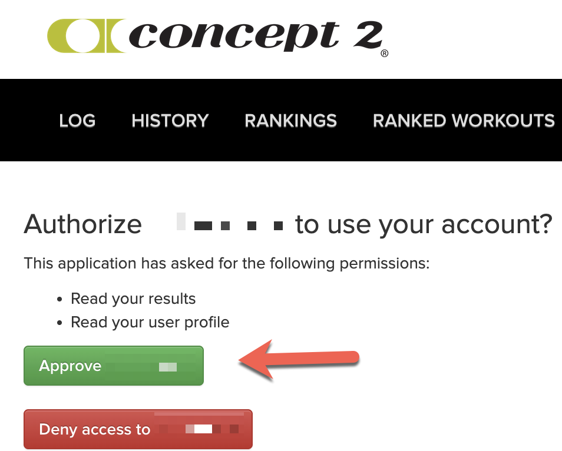

# Concept2 Logbook Pipeline

A production-grade ELT pipeline that ingests Concept2 Logbook rowing workout data into Postgres through three "medallion" layers, orchestrated by **Dagster** and loaded by **dlt**.

Dagster is a modern, open-source orchestration platform designed for data engineering, data science, and data analytics.

dlt (Data Load Tool) is an open-source Python library designed to solve one of the most tedious parts of data engineering: loading data from various sources (APIs, files, databases) into destinations (warehouses, data lakes, or databases).  In the traditional ELT (Extract, Load, Transform) paradigm, dlt focuses heavily on the E and the L. dlt is essentially an "EL" framework for Python developers.

<div align="center">
  
  <p><em>Dagster interface</em></p>
</div>

[//]: # (<div align="center">)

[//]: # (  )

[//]: # (  <p><em>Pace Trend Scatter Chart with Moving Average as generated by this concept2_pipeline application</em></p>)

[//]: # (</div>)

<div align="center">
  
  <p><em>Pace Trend Scatter Chart with Moving Average as generated by this concept2_pipeline application</em></p>
</div>

<!--
<figure align="center">
  
  <figcaption><em>The Concept2 PM5 Performance Monitor. Source: <a href="https://www.concept2.com/">Concept2.  The PM5 transmits your rowing performance details via bluetooth to your mobile phone.</a></em></figcaption>
</figure>
-->

<div align="center">
  
  <p><em>The Concept2 PM5 Performance Monitor. Source: <a href="https://www.concept2.com/">Concept2</a>.  The PM5 transmits your rowing performance details via bluetooth to the ErgData application on your mobile phone.</em></p>
</div>

<!-- 
The Concept2 PM5 (Performance Monitor 5) is the small, square computer monitor attached to Concept2 fitness equipment—most famously their Model D RowErg (rowing machine), but also their BikeErg and SkiErg.

It is widely considered the gold standard for fitness monitors in commercial gyms, CrossFit boxes, and home setups.

Here is what makes the PM5 so popular:

1. Brutal, Dead-Accurate Calibration
The biggest reason athletes love the PM5 is its reliability. It auto-calibrates against the machine's flywheel wind resistance on every single stroke or spin. Because it accounts for local air density, temperature, and even a dusty flywheel, a 500-meter split time on a PM5 in a humid garage in Florida is mathematically identical to a 500-meter split in a high-altitude gym in Colorado. This accuracy is why it’s used for official indoor rowing world records.

2. Modern Connectivity
While it looks a bit retro with its backlit LCD screen, the PM5 has excellent wireless capabilities:

Bluetooth & ANT+: It seamlessly connects to heart rate monitors (like Garmin or Polar straps), smartwatches, and tablets.

ErgData App: Concept2 has its own free app that syncs your phone to the PM5 to instantly log your workouts, track progress, and join a global daily leaderboard.

Third-Party Apps: It plays nice with popular apps like Zwift, EXR, and Regatta.

3. Diverse Data Views
By using the Display button at the bottom of the monitor, you can cycle through a few different ways to view your workout data in real-time:

All Data: Shows your pace (usually measured in time per 500 meters), total time, distance, and stroke rate (strokes per minute).

Force Graph: Traces a live visual curve of exactly how much power you are applying throughout your physical pull, helping you fix flaws in your technique.

Pace Boat: Puts a little graphic of a second boat on screen to race against a target pace or your own personal record.

4. Zero Charging Required
The PM5 takes two D-cell batteries, but you rarely have to change them. The monitor is actually self-powered by the generator inside the machine's flywheel. As soon as you start pulling or pedaling, the spinning flywheel provides all the electricity the screen needs to stay on, dramatically extending the battery life.
-->

```
Concept2 API ──dlt──► concept2_bronze.results   (raw)
                           │
                     SQL transform
                           │
                           ▼
                   concept2_silver.workouts  (cleaned)
                           │
                     Plotly charts
                           │
                           ▼
                     charts_output/*.png / *.html
```

---

## "Medallion" Architecture

Medallion architecture is a data design pattern that organizes data within a lakehouse or data lake into three progressive layers—Bronze, Silver, and Gold—to incrementally improve data quality, structure, and trust.  The medallion multi-hop approach allows raw data to be refined into business-ready assets while maintaining full traceability and governance.

| Layer  | Tool        | Postgres schema      | Description |
|--------|-------------|----------------------|-------------|
| Bronze | dlt         | `concept2_bronze`    | Raw API rows, incremental merge on `id` |
| Silver | SQLAlchemy  | `concept2_silver`    | Typed, cleaned, pace derived |
| Gold   | Plotly      | *(files on disk)*    | 7 interactive charts + PNGs |

---

## Incremental Loading

dlt tracks the highest `date` value seen across runs in its internal state
table (`concept2_bronze._dlt_pipeline_state`).  On every subsequent run only
workouts newer than that cursor are requested from the API:

```
GET /api/users/me/results?updated_after=<last_seen_date>&per_page=250
```

This means an account with years of history does a **full load only once**;
every subsequent daily run fetches only the new rows from the past 24 hours.

To force a full reload:
```bash
# Delete the dlt state for this pipeline (typically in the ~/.dlt directory) then re-run
python -c "
import dlt
p = dlt.pipeline('concept2_bronze', destination='postgres', dataset_name='concept2_bronze')
p.drop()
"
```

---

## Quick Start (local, no Docker)

### 1. Prerequisites

- Python 3.11+
- Postgres running locally (or update `PG_CONN`)

### 2. Install
```bash
# If you haven't installed uv on your local machine yet (MacOS/Linux):
curl -LsSf https://astral.sh/uv/install.sh | sh
```

```bash
cd concept2_pipeline
# pip install -e .
uv sync
```

### 3. Configure environment

```bash
cp .env.example .env
# Edit .env — fill in C2_CLIENT_ID and C2_CLIENT_SECRET
```

### 4. Obtain OAuth token (one-time)

```bash
python -m concept2_pipeline.auth
```

Your web browser opens to https://log.concept2.com/login.  Enter your username and password.

[//]: # (![Web browser login screen]&#40;images/web-browser-login-screen.png&#41;)

[//]: # (<div align="center">)

[//]: # (  )

[//]: # (  <p><em>Dagster interface</em></p>)

[//]: # (</div>)

<div align="center">
<figure>
  
  <p><em>Web browser login screen</em></p>
</figure>
</div>

Approve access in the browser; a token is written to the .env file.

<div align="center">
<figure>
  
  <p><em>Approve access</em></p>
</figure>
</div>

### 5. Export env vars

```bash
export $(grep -v '^#' .env | xargs)
```

### 6. Configure dlt Postgres credentials

Edit `.dlt/secrets.toml`:
```toml
[destination.postgres.credentials]
database = "concept2"
username = "concept2"
password = "concept2pass"
host     = "localhost"
port     = 5432
```

### 7. Start Dagster

```bash
dagster dev -m concept2_pipeline.definitions
```

Open [http://localhost:3000](http://localhost:3000), go to **Assets**, and
click **Materialize All**.

---

## Docker Compose

```bash
cp .env.example .env
# Fill in C2_CLIENT_ID, C2_CLIENT_SECRET, C2_ACCESS_TOKEN

docker compose up --build
```

Dagster UI at [http://localhost:3000](http://localhost:3000).

Note: obtain `C2_ACCESS_TOKEN` on your host first:
```bash
pip install requests requests-oauthlib
python -m concept2_pipeline.auth
# Copy token into .env as C2_ACCESS_TOKEN
```

---

## Daily Schedule

The pipeline is scheduled to run every day at **06:00 UTC** via the
`concept2_daily_refresh` schedule (enabled by default).  You can also trigger
it manually from the Dagster UI or CLI:

```bash
dagster job execute -m concept2_pipeline.definitions -j concept2_full_pipeline
```

---

## Charts generated

| File | Description |
|------|-------------|
| `monthly_distance_bar.png` | Total metres per calendar month |
| `cumulative_distance_line.png` | Running total distance over time |
| `pace_trend_scatter.png` | Pace per 500m + 30-workout moving average |
| `heart_rate_trend.png` | Avg + max HR per workout |
| `workout_type_breakdown.png` | Donut chart by activity type |
| `distance_histogram.png` | Distribution of individual workout distances |
| `weekly_volume_stacked.png` | Weekly volume stacked by activity type |

Each chart is also saved as an interactive `.html` file in `charts_output/`.

---

## Project Layout

```
concept2_pipeline/
├── concept2_pipeline/
│   ├── auth.py                  # OAuth2 token helper (run once)
│   ├── definitions.py           # Dagster Definitions entry point
│   ├── assets/
│   │   ├── bronze.py            # dlt_assets → concept2_bronze schema
│   │   ├── silver.py            # SQL transform → concept2_silver schema
│   │   └── gold.py              # Plotly charts → charts_output/
│   ├── resources/
│   │   └── postgres_resource.py # Configurable SQLAlchemy resource
│   └── sources/
│       └── concept2_source.py   # dlt @source + @resource (incremental)
├── charts_output/               # Generated charts (git-ignored)
├── .dlt/
│   └── secrets.toml             # dlt Postgres credentials (git-ignored)
├── .env.example                 # Environment variable template
├── docker-compose.yml
├── Dockerfile
├── workspace.yaml
└── pyproject.toml
```

---

## Environment Variables

| Variable | Description |
|----------|-------------|
| `C2_CLIENT_ID` | Concept2 OAuth app client ID |
| `C2_CLIENT_SECRET` | Concept2 OAuth app client secret |
| `C2_ACCESS_TOKEN` | Bearer token from `python -m concept2_pipeline.auth` |
| `PG_CONN` | SQLAlchemy Postgres URL (used by silver + gold layers) |
| `CHARTS_OUTPUT_DIR` | Override chart output directory (default: `charts_output`) |
| `DAGSTER_POSTGRES_*` | Dagster run-history DB (see docker-compose.yml) |
